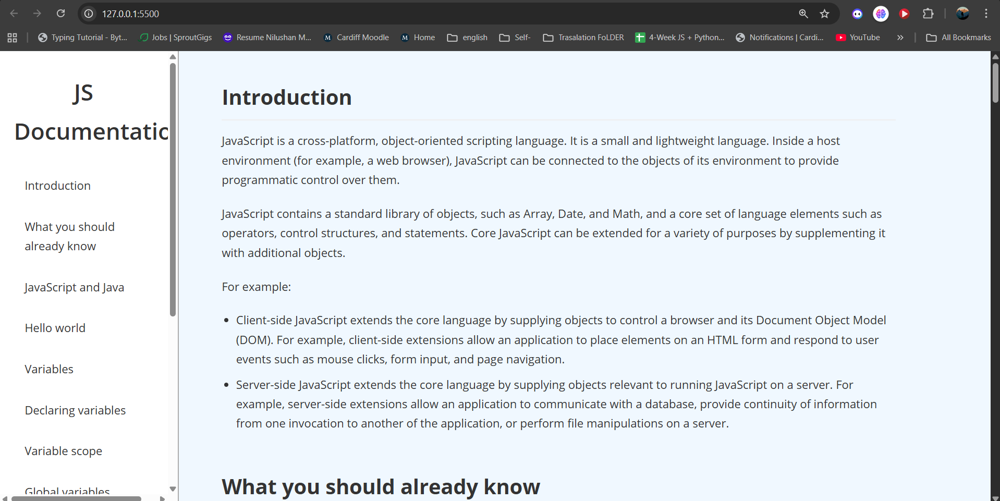

# Technical Documentation Page - JavaScript Guide

 
  

A clean, responsive, and well-structured technical documentation page for **JavaScript**, created as a learning project.  
This page includes a navigation bar, sections on JavaScript basics, variables, functions, loops, and references to MDN.

---

## 📸 Project Preview

  

---

## 🗂️ Project Structure

technical-documentation-page/ 
│ 
├── index.html  # Main HTML file with content and structure 
├── styles.css  # CSS file for layout, styling, and responsiveness 
└── README.md   # Project documentation

---

## 🖥️ Built With

- **HTML5** – Semantic structure for sections, navigation, and content  
- **CSS3** – Styling, layout, navigation, and responsive design  

---

## ⚙️ Features

- Fully responsive design for mobile and desktop  
- Fixed navigation bar with smooth scrolling  
- Well-organized sections covering JavaScript topics  
- Code blocks for examples  
- Reference section linking to MDN documentation  

---

## Live Demo

[View the live demo](https://nilushan-dev.github.io/JS-Documentation-Page/)

---

## 👤 Author

**Nilushan Dev** – [GitHub](https://github.com/nilushan-dev)
